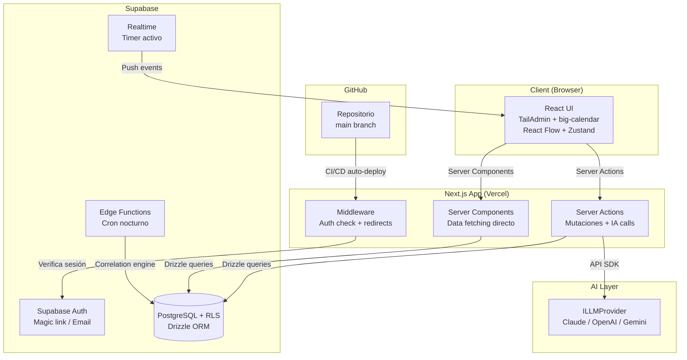
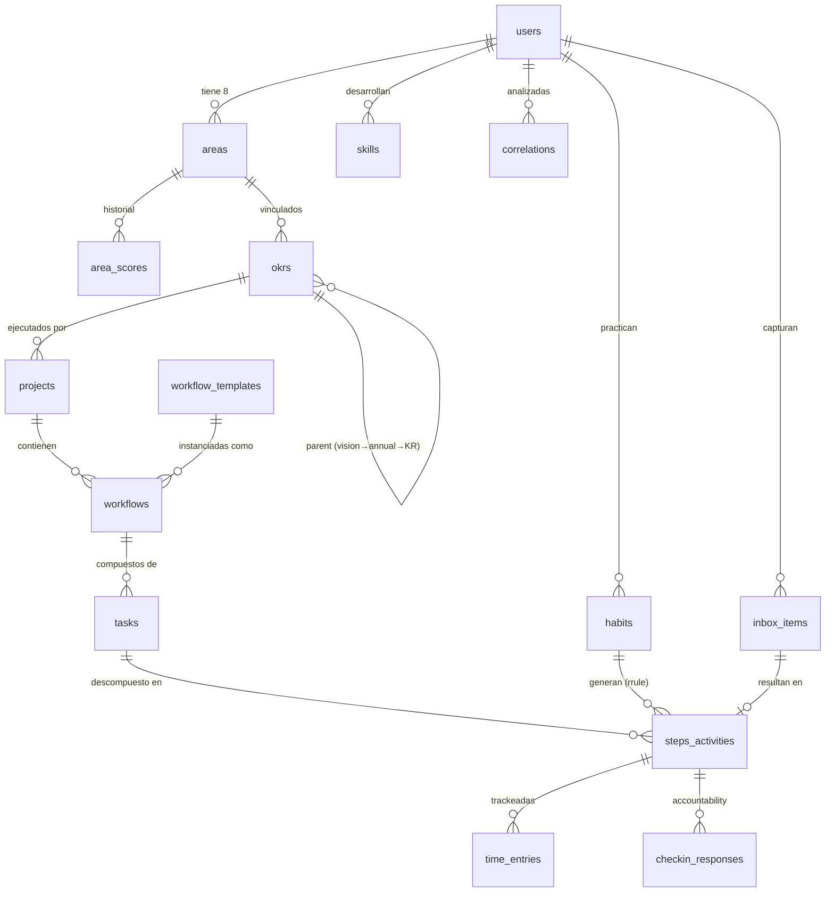
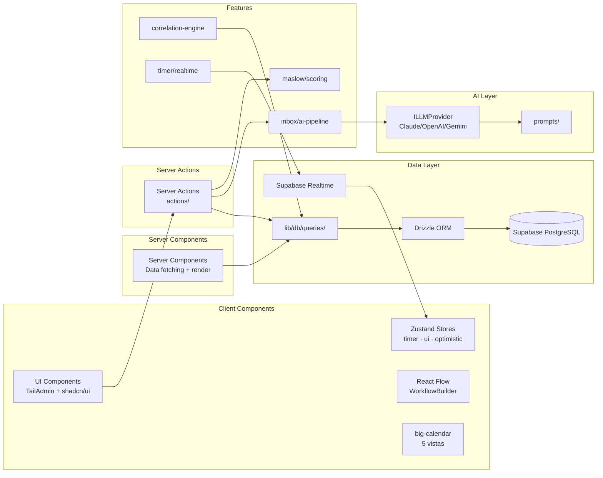
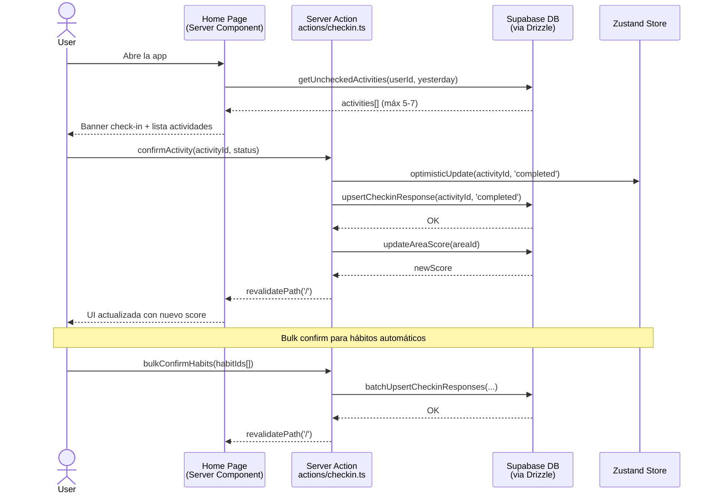
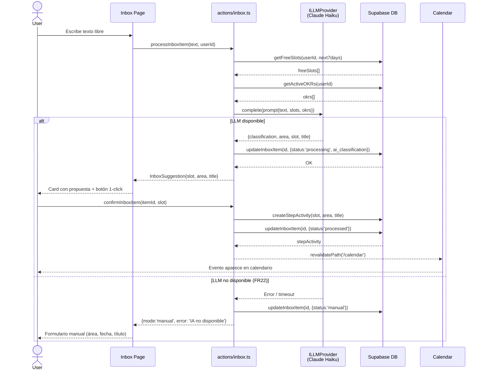
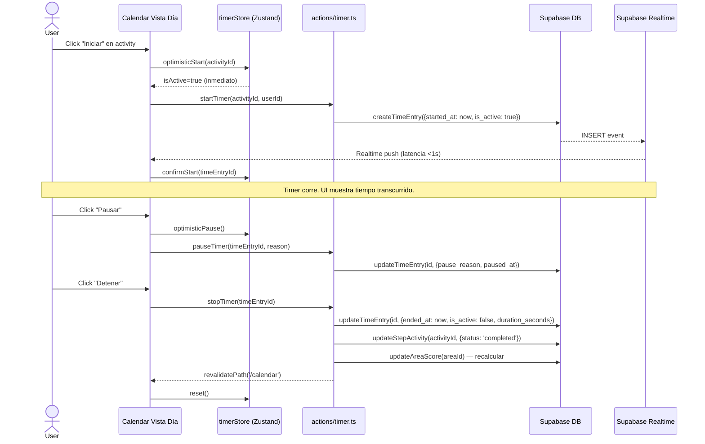
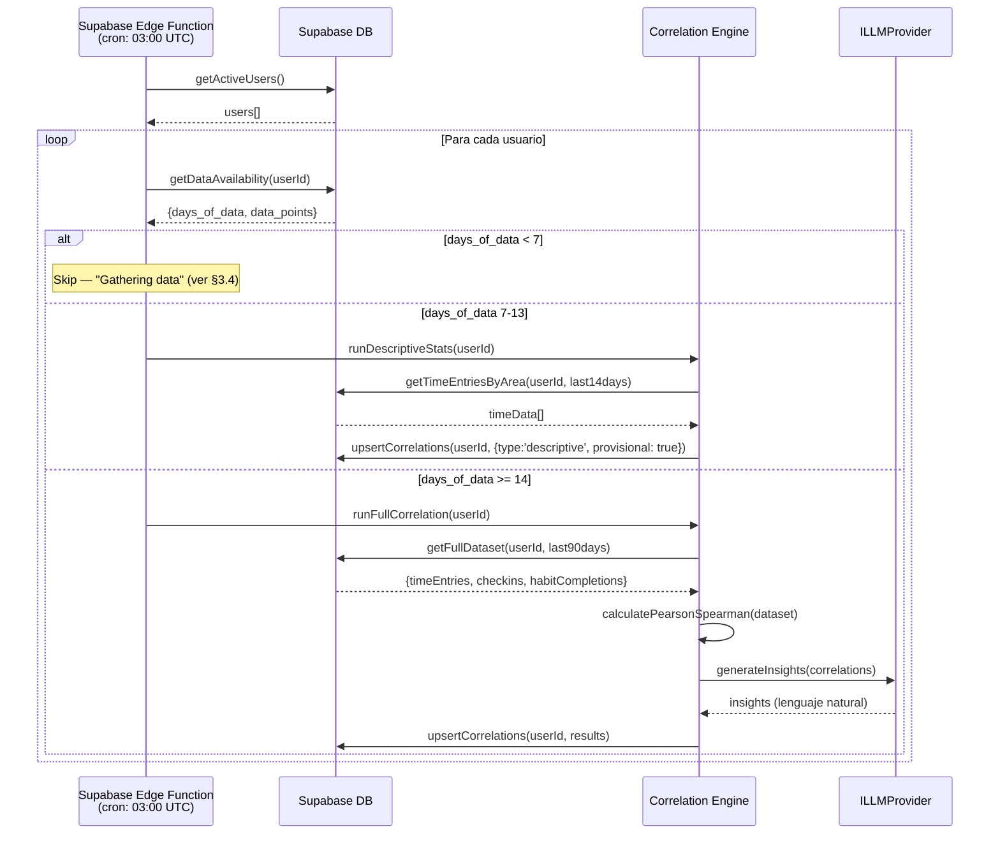

# life-os Architecture Document

> **Generado por:** Aria (Visionary) — @architect Agent
> **Fecha:** 2026-02-20
> **Estado:** v1.0 — Draft para revisión
> **Basado en:** docs/prd.md v1.1 · docs/brief.md v1.8
> **Handoff de:** @po (Pax) — PRD validado GO ✅

---

## Change Log

| Fecha      | Versión | Descripción                                                                                             | Autor             |
| ---------- | ------- | ------------------------------------------------------------------------------------------------------- | ----------------- |
| 2026-02-20 | 1.0     | Arquitectura inicial — decisiones ORM + correlaciones resueltas, stack completo, source tree, workflows | Aria (@architect) |

---

## 1. Introduction

### 1.1 Scope del Documento

Este documento define la arquitectura técnica completa de **life-os** — un sistema operativo personal construido sobre Next.js + Supabase + Vercel. Cubre: stack de tecnología (fuente de verdad definitiva), modelos de datos conceptuales, componentes del sistema, flujos críticos, estructura de código, infraestructura, estándares de desarrollo y seguridad.

**Relación con el PRD:** Este documento es complementario al PRD v1.1. Las decisiones de producto y requisitos funcionales viven en el PRD. Las decisiones técnicas de implementación viven aquí. En caso de conflicto, este documento prevalece en lo técnico.

**Audiencia primaria:** @dev (Dex), @data-engineer (Dara), @qa (Quinn), @devops (Gage).

### 1.2 Starter Template / Base Existente

life-os parte de **TailAdmin** (`github.com/TailAdmin/free-nextjs-admin-dashboard`) como base de layout + UI framework. Este template provee:

- Next.js 16 + React 19 + Tailwind CSS 4 configurado
- Sidebar con navegación, Navbar, dark mode nativo
- ApexCharts integrado (se usará para Informes)
- Estructura de carpetas `app/` básica con App Router
- shadcn/ui pre-instalado

**Impacto en arquitectura:** La estructura de carpetas del proyecto adapta TailAdmin como punto de partida, reemplazando sus páginas de demo con las features de life-os. El sistema de estilos es Tailwind CSS 4 nativo — no se introduce CSS-in-JS ni estilos adicionales.

---

## 2. High Level Architecture

### 2.1 Technical Summary

life-os es una **aplicación monolítica full-stack** construida sobre Next.js 16 con App Router, donde el servidor y el cliente coexisten en un único repositorio y despliegue. La capa de datos es Supabase (PostgreSQL con RLS), accedida vía Drizzle ORM para type-safety y gestión de migraciones. La comunicación cliente-servidor usa **Next.js Server Actions** — sin capa REST separada en MVP. El estado global de UI se gestiona con Zustand; el estado del servidor se deriva de Server Components y refrescado por revalidación post-action. La arquitectura de IA es multi-proveedor via interfaz `ILLMProvider`, invocada desde Server Actions. Supabase Realtime alimenta el único caso de uso que requiere push en tiempo real: el timer activo.

### 2.2 High Level Overview

| Dimensión                | Decisión                                                            | Justificación                                                                |
| ------------------------ | ------------------------------------------------------------------- | ---------------------------------------------------------------------------- |
| **Estilo arquitectural** | Monolito modular (feature-based)                                    | MVP single-user, un desarrollador + AIOS. Sin overhead de microservicios.    |
| **Repository**           | Monorepo (single Next.js app)                                       | Todo en un repositorio: frontend, server actions, DB schema, edge functions. |
| **API layer**            | Next.js Server Actions                                              | Sin REST API separada en MVP. Reduce boilerplate, type-safe end-to-end.      |
| **Renderizado**          | Server Components por defecto + Client Components donde necesario   | Máximo performance, datos frescos sin fetch en cliente.                      |
| **Data fetching**        | Server Components leen directo de DB; mutaciones via Server Actions | Simple, sin capa de API, RLS aplicado en Supabase.                           |
| **Realtime**             | Supabase Realtime solo para timer activo                            | Latencia <1s requerida solo en ese caso de uso (NFR7).                       |
| **Background jobs**      | Supabase Edge Functions (cron nocturno)                             | Motor de correlaciones — no bloquea UI.                                      |

### 2.3 Diagrama de Arquitectura



### 2.4 Patrones Arquitecturales

- **Feature-based Module Pattern:** El código se organiza por feature (calendar, okrs, inbox, etc.), no por tipo de archivo. Cada feature es autónoma con sus server actions, components y types.
- **Server Action Pattern:** Las mutaciones ocurren en Server Actions (funciones `async` marcadas con `'use server'`). El cliente llama acciones, no endpoints HTTP. Type-safety end-to-end sin codegen.
- **Repository Pattern (Drizzle):** Las queries de DB se encapsulan en funciones en `lib/db/queries/`. Ni los Server Actions ni los Server Components acceden a Drizzle directamente — siempre via funciones de query.
- **Provider Pattern (IA):** La interfaz `ILLMProvider` abstrae el proveedor de IA. El Server Action instancia el proveedor activo via factory, sin código condicional en la lógica de negocio.
- **Optimistic UI Pattern:** Para interacciones críticas (timer start/stop, check-in confirm), la UI actualiza Zustand localmente antes de que complete el Server Action, con rollback en caso de error.

---

## 3. Tech Stack

### 3.1 Cloud Infrastructure

- **Provider:** Vercel (frontend + server actions) + Supabase (database + auth + realtime)
- **Key Services:** Vercel Edge Runtime (middleware), Supabase PostgreSQL, Supabase Auth, Supabase Realtime, Supabase Edge Functions (cron jobs)
- **Deployment Region:** Vercel → auto (CDN global); Supabase → `us-east-1` (free tier default)
- **Budget MVP:** $0 — Vercel Hobby + Supabase Free Tier (≤500MB DB, ≤50MB file storage)

### 3.2 Technology Stack Table

| Categoría             | Tecnología                 | Versión | Propósito                                    | Justificación                                    |
| --------------------- | -------------------------- | ------- | -------------------------------------------- | ------------------------------------------------ |
| **Framework**         | Next.js                    | 16.1.6  | Full-stack app framework (App Router)        | Stack mandatorio del PRD                         |
| **UI Library**        | React                      | 19.x    | Component model                              | Stack mandatorio del PRD                         |
| **Lenguaje**          | TypeScript                 | 5.x     | Type safety completo                         | Previene errores en schema complejo              |
| **Estilos**           | Tailwind CSS               | 4.x     | Utility-first CSS                            | Stack mandatorio + TailAdmin nativo              |
| **Layout Base**       | TailAdmin                  | 2.2.2   | Sidebar, navbar, dashboard, dark mode        | MIT, Next.js 16 + Tailwind v4 nativo             |
| **UI Components**     | shadcn/ui                  | latest  | Componentes accesibles reutilizables         | Viene con TailAdmin; sin vendor lock-in          |
| **Calendario**        | big-calendar (lramos33)    | latest  | 5 vistas calendario (Año/Mes/Sem/Día/Agenda) | MIT, shadcn/ui, drag&drop nativo                 |
| **Recurrencia**       | rrule                      | 2.x     | RFC 5545 — eventos recurrentes on-the-fly    | Estándar de facto, sin pre-generar ocurrencias   |
| **Workflow Builder**  | @xyflow/react (React Flow) | 12.x    | Canvas visual estilo n8n para workflows      | MIT, 11.5k dependents, nodos/edges customizables |
| **Charts**            | ApexCharts (TailAdmin)     | 3.x     | Gráficos en Informes                         | Ya incluido en TailAdmin                         |
| **Base de datos**     | Supabase (PostgreSQL)      | Cloud   | DB relacional con RLS                        | Stack mandatorio                                 |
| **ORM**               | Drizzle ORM                | 0.39.x  | Type-safe queries + migraciones              | **DECISIÓN RESUELTA** — ver §3.3                 |
| **Auth**              | Supabase Auth              | Cloud   | Magic link + email/password                  | Stack mandatorio                                 |
| **Realtime**          | Supabase Realtime          | Cloud   | Timer activo (latencia <1s)                  | Solo para NFR7                                   |
| **Edge Functions**    | Supabase Edge Functions    | Deno    | Cron job correlaciones nocturno              | NFR8                                             |
| **Estado Global**     | Zustand                    | 5.x     | UI state + timer state + optimistic updates  | Minimal, sin boilerplate de Redux                |
| **IA — Abstracción**  | ILLMProvider (custom)      | —       | Interfaz multi-proveedor                     | FR15 — sin vendor lock-in                        |
| **IA — MVP Provider** | Claude (Anthropic SDK)     | Haiku   | Clasificación inbox, correlaciones, review   | Velocidad + costo óptimo para MVP                |
| **Deploy**            | Vercel                     | Cloud   | Hosting + CI/CD automático                   | FR NFR3                                          |
| **CI/CD**             | GitHub Actions + Vercel    | —       | Auto-deploy main + PR previews               | NFR3                                             |
| **Testing**           | Vitest                     | 3.x     | Unit + integration tests                     | Story 1.6 — fast, compatible Vite/Next           |
| **Testing UI**        | React Testing Library      | 16.x    | Component testing                            | Story 1.6                                        |
| **Linting**           | ESLint + Prettier          | latest  | Code style                                   | Viene con Next.js                                |
| **Git hooks**         | Husky + lint-staged        | latest  | Pre-commit checks                            | Calidad automática                               |

### 3.3 Decisión Resuelta: ORM

**Decisión: Drizzle ORM** ✅

| Criterio                 | Supabase JS Client                   | Drizzle ORM                                 |
| ------------------------ | ------------------------------------ | ------------------------------------------- |
| Type safety              | Parcial (tipos generados desde DB)   | Total (schema como código, tipos inferidos) |
| Migraciones              | Manual (SQL directo o Supabase UI)   | Automático (`drizzle-kit push/generate`)    |
| Queries complejas        | `rpc()` + SQL manual                 | Type-safe query builder                     |
| RLS compatibility        | Total (client respeta RLS)           | Total (usa Supabase connection)             |
| Curva de aprendizaje     | Baja                                 | Baja-media                                  |
| Bundle size              | 0 (client-side)                      | ~50KB (server only)                         |
| Ideal para correlaciones | No (SQL manual para joins complejos) | Sí (joins type-safe)                        |

**Justificación:** El schema de life-os tiene ~15 tablas con relaciones complejas (activities → steps → tasks → workflows → projects). El motor de correlaciones requiere joins de 4-5 tablas. Drizzle provee type-safety en todas las queries sin codegen externo, y gestiona migraciones automáticamente — crítico para un schema que evolucionará significativamente durante el desarrollo. La compatibilidad con RLS de Supabase es total (Drizzle usa la connection de Supabase). **Costo marginal de adoptar Drizzle en MVP: ~2h de setup. Beneficio: elimina bugs de SQL manual durante todo el desarrollo.**

```typescript
// Ejemplo: Drizzle ORM con Supabase
import { drizzle } from 'drizzle-orm/postgres-js'
import postgres from 'postgres'

const connectionString = process.env.DATABASE_URL! // Supabase connection string
const client = postgres(connectionString)
export const db = drizzle(client)
```

---

## 4. Data Models (Conceptual)

> **Nota:** Los modelos conceptuales aquí definen entidades y relaciones. El DDL completo (CREATE TABLE, índices, RLS policies, triggers) es responsabilidad de @data-engineer (Dara).

### 4.1 Modelo Central — Jerarquía de Vida

```
User
└── Area (8 fijas — Maslow hierarchy)
    ├── AreaScore (histórico de scores diarios)
    └── OKR (Visión 5Y → Anual → KR trimestral)
        └── Project
            └── Workflow (template-based)
                └── Task (fase)
                    └── Step/Activity (executor_type: human|ai|mixed)
                        └── TimeEntry (start/stop)
```

### 4.2 Entidades Principales

**`areas`** — Las 8 áreas Maslow (datos semi-estáticos por usuario)

- `id`, `user_id`, `maslow_level` (1-8), `name`, `group` (d_needs|b_needs), `weight_multiplier`
- `current_score` (0-100), `last_activity_at`

**`area_scores`** — Histórico de scores (snapshot diario)

- `id`, `area_id`, `user_id`, `score`, `scored_at` (date)

**`okrs`** — OKRs y Visión

- `id`, `user_id`, `type` (vision|annual|key_result), `parent_id`, `title`, `description`
- `quarter` (Q1-Q4), `year`, `area_id`, `progress` (0-100, calculado)
- `status` (active|completed|cancelled)

**`projects`** — Proyectos vinculados a área + KR opcional

- `id`, `user_id`, `area_id`, `okr_id?`, `title`, `description`
- `status` (active|completed|archived), `template_id?`

**`workflows`** — Flujos dentro de proyectos

- `id`, `project_id`, `user_id`, `title`, `template_id?`
- `squad_type` (dev|research|coach|none), `status`

**`tasks`** — Fases de un workflow

- `id`, `workflow_id`, `user_id`, `title`, `order`, `status`

**`steps_activities`** — Entidad unificada (FR5 — Steps = Activities)

- `id`, `task_id?`, `user_id`, `area_id`
- `title`, `description`, `executor_type` (human|ai|mixed)
- `planned` (boolean), `ai_agent?`, `verification_criteria?`
- `status` (pending|in_progress|completed|skipped)
- `scheduled_at?`, `completed_at?`
- `is_habit` (boolean), `habit_id?`

**`time_entries`** — Tracking de tiempo

- `id`, `step_activity_id`, `user_id`
- `started_at`, `ended_at?`, `duration_seconds?`
- `pause_reason?`, `is_active` (boolean)

**`habits`** — Hábitos recurrentes

- `id`, `user_id`, `area_id`, `title`
- `rrule` (string RFC 5545), `duration_minutes`
- `streak_current`, `streak_best`, `last_completed_at`

**`inbox_items`** — Captura de Inbox

- `id`, `user_id`, `raw_text`, `status` (pending|processing|processed|manual)
- `ai_classification?`, `ai_suggested_area_id?`, `ai_suggested_slot?`
- `step_activity_id?` (resultado del procesamiento), `created_at`

**`checkin_responses`** — Daily Check-in

- `id`, `user_id`, `step_activity_id`, `checkin_date`
- `status` (completed|skipped|postponed), `energy_level?` (1-5)
- `notes?`

**`skills`** — Habilidades con nivel

- `id`, `user_id`, `area_id?`, `name`
- `level` (beginner|intermediate|advanced|expert)
- `time_invested_seconds` (calculado desde time_entries), `auto_detected` (boolean)

**`correlations`** — Resultados del motor de correlaciones (caché)

- `id`, `user_id`, `computed_at`
- `type` (positive|negative|neutral), `confidence` (0-1)
- `entity_a_type`, `entity_a_id`, `entity_b_type`, `entity_b_id`
- `correlation_value` (Pearson/Spearman), `description_nl` (lenguaje natural)
- `data_points_count`, `days_of_data`

**`workflow_templates`** — Templates predefinidos (8 MVP)

- `id`, `name`, `category`, `executor_type_default`
- `tasks_config` (JSONB — estructura de tasks/steps)
- `squad_type`, `description`

### 4.3 Diagrama ER Simplificado



---

## 5. Components

### 5.1 Feature Components

**`features/maslow/`** — Motor de Scoring Maslow

- **Responsabilidad:** Calcular score por área y Life System Health Score global con multiplicadores ponderados
- **Interfaces:** `calculateAreaScore(responses) → number`, `calculateGlobalScore(areaScores) → number`, `getAlerts(areaScores) → Alert[]`
- **Dependencias:** `lib/db/queries/area-scores.ts`
- **Nota:** Código puro, sin IA. Fórmula: `Score_global = Σ(score_área × multiplicador) / Σ(multiplicadores)` donde Σpesos = 11.4

**`features/calendar/`** — Adaptador big-calendar

- **Responsabilidad:** Adaptar big-calendar a Tailwind CSS 4 (migración v3→v4), integrar rrule para eventos recurrentes, conectar con Supabase Realtime para timer
- **Interfaces:** `<LifeCalendar />` (wrapper), `generateOccurrences(rrule, range) → Event[]`
- **Dependencias:** `big-calendar`, `rrule`, `features/timer/`

**`features/correlation-engine/`** — Motor Estadístico

- **Responsabilidad:** Calcular correlaciones Pearson/Spearman entre métricas. Detectar bucles, leverage points, bottlenecks. Generar insights en lenguaje natural via ILLMProvider.
- **Interfaces:** `runCorrelationAnalysis(userId) → CorrelationResult[]`, `generateInsights(correlations) → string`
- **Dependencias:** `lib/db/queries/correlations.ts`, `lib/ai/providers/`
- **Ejecución:** Solo desde Supabase Edge Function (cron nocturno). No en UI.

**`features/workflow-builder/`** — Visual Workflow Builder

- **Responsabilidad:** Canvas React Flow con nodos Task + Step, coloreado por executor_type
- **Interfaces:** `<WorkflowBuilder workflowId={id} />`, nodos customizados por tipo
- **Dependencias:** `@xyflow/react`
- **Colores:** azul=human, púrpura=ai, degradado=mixed

**`features/inbox/`** — Procesamiento IA de Inbox

- **Responsabilidad:** Pipeline: texto libre → clasificación IA → propuesta slot → confirmación → activity creada
- **Interfaces:** `processInboxItem(text, userId) → InboxSuggestion`, `confirmInboxItem(itemId, slot) → StepActivity`
- **Dependencias:** `lib/ai/providers/`, `lib/db/queries/calendar.ts`
- **Fallback:** Si ILLMProvider falla → modo manual automático (FR22)

**`features/timer/`** — Time Tracking con Realtime

- **Responsabilidad:** Start/stop/pause con Realtime Supabase. Estado en Zustand para UI optimista.
- **Interfaces:** `useTimer(stepActivityId)` → hook con `start()`, `pause(reason)`, `stop()`
- **Dependencias:** Supabase Realtime, Zustand `timerStore`

### 5.2 AI Layer

**`lib/ai/providers/`** — Multi-proveedor IA

```typescript
interface ILLMProvider {
  complete(prompt: string, options?: LLMOptions): Promise<string>
  isAvailable(): Promise<boolean>
}

class ClaudeProvider implements ILLMProvider { ... }
class OpenAIProvider implements ILLMProvider { ... }
class GeminiProvider implements ILLMProvider { ... }

// Factory — lee env vars para seleccionar proveedor
function createLLMProvider(): ILLMProvider
```

**`lib/ai/prompts/`** — Templates de prompts por caso de uso

- `inbox-classification.ts` — Clasificación + área + slot sugerido
- `correlation-insights.ts` — Patrones en lenguaje natural
- `weekly-review.ts` — Síntesis semanal
- `area-diagnosis.ts` — Análisis diagnóstico inicial

### 5.3 Data Layer

**`lib/db/schema/`** — Schema Drizzle ORM (fuente de verdad del schema)

- `areas.ts`, `okrs.ts`, `projects.ts`, `workflows.ts`, `steps-activities.ts`, `habits.ts`, `inbox.ts`, `skills.ts`, `correlations.ts`, `templates.ts`

**`lib/db/queries/`** — Funciones de query reutilizables

- Cada dominio tiene su archivo: `areas.ts`, `calendar.ts`, `correlations.ts`, etc.
- **Regla:** Ningún Server Action accede a `db` directamente — siempre via estas funciones

**`actions/`** — Next.js Server Actions por feature

- `actions/calendar.ts`, `actions/inbox.ts`, `actions/okrs.ts`, etc.
- Usan funciones de `lib/db/queries/` y `lib/ai/providers/`

### 5.4 Diagrama de Componentes



---

## 6. External APIs

### 6.1 Supabase API

- **Propósito:** PostgreSQL (DB), Auth, Realtime, Edge Functions
- **Autenticación:** `SUPABASE_URL` + `SUPABASE_ANON_KEY` (client) + `SUPABASE_SERVICE_ROLE_KEY` (server actions)
- **Rate Limits:** Free tier — 500MB DB, 1GB bandwidth, 50MB storage, 2M Edge Function invocations/mes
- **Integración:** Drizzle ORM sobre connection string PostgreSQL directo; Auth via `@supabase/ssr` para App Router

```typescript
// lib/supabase/server.ts — Client para Server Components / Actions
import { createServerClient } from '@supabase/ssr'
// lib/supabase/client.ts — Client para Client Components (Realtime)
import { createBrowserClient } from '@supabase/ssr'
```

### 6.2 Anthropic Claude API (ILLMProvider MVP)

- **Propósito:** Clasificación inbox, insights correlaciones, weekly review, diagnóstico inicial
- **Modelo MVP:** `claude-haiku-4-5` — latencia baja, costo mínimo, suficiente para clasificación
- **Autenticación:** `ANTHROPIC_API_KEY` (server-side only, nunca expuesta al client)
- **Rate Limits:** Haiku — 5 req/min en free, 50 req/min en tier 1
- **Fallback:** Si Claude falla → fallback a modo manual (FR22)

```typescript
// lib/ai/providers/claude.ts
import Anthropic from '@anthropic-ai/sdk'
class ClaudeProvider implements ILLMProvider {
  private client = new Anthropic({ apiKey: process.env.ANTHROPIC_API_KEY })
  async complete(prompt: string): Promise<string> { ... }
  async isAvailable(): Promise<boolean> { ... }
}
```

### 6.3 OpenAI API (ILLMProvider alternativa)

- **Propósito:** Proveedor alternativo, intercambiable via env var `LLM_PROVIDER=openai`
- **Modelo sugerido:** `gpt-4o-mini` para MVP (equivalente en costo/velocidad a Haiku)
- **Autenticación:** `OPENAI_API_KEY` (server-side only)

### 6.4 Vercel Deployment API

- **Propósito:** Auto-deploy desde GitHub + PR previews
- **Configuración:** via `vercel.json` + secrets en Vercel dashboard
- **No requiere integración programática** — solo webhook de GitHub

---

## 7. Core Workflows

### 7.1 Daily Check-in Flow



### 7.2 Inbox → IA → Calendario Flow



### 7.3 Timer Start/Stop con Realtime



### 7.4 Motor de Correlaciones (Cron Nocturno)



---

## 8. Database Schema (High-Level)

> **Delegado a @data-engineer (Dara):** El DDL completo (CREATE TABLE, índices, RLS policies, triggers, migraciones Drizzle) debe ser creado por @data-engineer en base a los modelos conceptuales de §4 y las decisiones de aquí.

### 8.1 Decisiones de Schema que @architect define

| Decisión                                  | Elección                                                      | Razón                                                                                            |
| ----------------------------------------- | ------------------------------------------------------------- | ------------------------------------------------------------------------------------------------ |
| UUID vs BIGINT para PKs                   | UUID (`gen_random_uuid()`)                                    | RLS de Supabase funciona mejor con UUIDs; sin colisiones cross-tabla                             |
| `steps` vs `activities`                   | Tabla única `steps_activities`                                | Modelo unificado (FR5) — campo `planned` distingue steps planeados de actividades espontáneas    |
| `areas` — estáticas o por usuario         | Tabla `areas` con `user_id` + `maslow_level` (1-8 prefijados) | Usuario personaliza nombres pero los 8 niveles son fijos. Permite scores históricos por usuario. |
| JSON vs columnas para config de templates | JSONB para `tasks_config` en `workflow_templates`             | Estructura flexible sin migraciones cada vez que evoluciona un template                          |
| Correlaciones — calcular o cachear        | Cachear en tabla `correlations`                               | El cálculo es costoso (Pearson sobre 90 días). Se invalida en cada cron nocturno.                |
| RLS                                       | **Todas las tablas con RLS**                                  | NFR2 — sin excepción. `user_id = auth.uid()` en todas las policies                               |

### 8.2 Índices Mínimos Requeridos

Estos índices son obligatorios por performance (definición exacta por @data-engineer):

- `steps_activities(user_id, scheduled_at)` — queries del calendario
- `time_entries(user_id, started_at, is_active)` — timer activo + reportes
- `area_scores(area_id, scored_at DESC)` — tendencia histórica
- `correlations(user_id, computed_at DESC)` — última correlación por usuario
- `inbox_items(user_id, status)` — cola de inbox pendiente
- `checkin_responses(user_id, checkin_date)` — check-in diario

### 8.3 Drizzle Schema Entry Point

```typescript
// lib/db/schema/index.ts — barrel export de todos los schemas
export * from './areas'
export * from './okrs'
export * from './projects'
export * from './workflows'
export * from './steps-activities'
export * from './habits'
export * from './inbox'
export * from './skills'
export * from './correlations'
export * from './templates'
```

---

## 9. Source Tree

```
life-os/
├── app/                            # Next.js App Router
│   ├── (auth)/                     # Rutas sin sidebar
│   │   ├── login/
│   │   │   └── page.tsx
│   │   └── onboarding/
│   │       └── page.tsx
│   ├── (app)/                      # Rutas con layout TailAdmin
│   │   ├── layout.tsx              # Sidebar + Navbar + auth check
│   │   ├── page.tsx                # Home — Execution Space
│   │   ├── areas/
│   │   │   └── page.tsx            # Vista Áreas de Vida
│   │   ├── okrs/
│   │   │   └── page.tsx            # Vista OKRs
│   │   ├── projects/
│   │   │   ├── page.tsx
│   │   │   └── [id]/
│   │   │       ├── page.tsx        # Detalle proyecto
│   │   │       └── workflow/
│   │   │           └── page.tsx    # Visual Workflow Builder
│   │   ├── calendar/
│   │   │   └── page.tsx            # Calendario 5 vistas
│   │   ├── inbox/
│   │   │   └── page.tsx
│   │   ├── habits/
│   │   │   └── page.tsx
│   │   ├── skills/
│   │   │   └── page.tsx
│   │   ├── reports/
│   │   │   └── page.tsx            # Informes + correlaciones
│   │   └── weekly-review/
│   │       └── page.tsx
│   ├── layout.tsx                  # Root layout
│   └── globals.css                 # Tailwind CSS 4 + TailAdmin styles
│
├── components/                     # Componentes compartidos
│   ├── ui/                         # shadcn/ui components (generados)
│   └── shared/                     # Componentes propios reutilizables
│       ├── MaslowScoreCard.tsx
│       ├── TimerWidget.tsx
│       ├── DailyCheckinBanner.tsx
│       └── AreaBadge.tsx
│
├── features/                       # Lógica de dominio por feature
│   ├── maslow/
│   │   ├── scoring.ts              # calculateAreaScore, calculateGlobalScore
│   │   └── alerts.ts               # getAlerts, getBalancingSuggestions
│   ├── calendar/
│   │   ├── big-calendar-adapter.tsx # Wrapper + Tailwind v4 migration
│   │   └── rrule-utils.ts          # generateOccurrences, parseRRule
│   ├── correlation-engine/
│   │   ├── pearson.ts              # Pearson correlation calculation
│   │   ├── spearman.ts             # Spearman correlation calculation
│   │   ├── tiered-analysis.ts      # Tiered approach por días de datos
│   │   └── pattern-detector.ts     # Bucles, leverage, bottlenecks
│   ├── workflow-builder/
│   │   ├── WorkflowCanvas.tsx      # React Flow canvas
│   │   ├── nodes/
│   │   │   ├── TaskNode.tsx        # Nodo Task (rectángulo)
│   │   │   └── StepNode.tsx        # Nodo Step (círculo coloreado)
│   │   └── edges/
│   │       └── DependencyEdge.tsx
│   ├── inbox/
│   │   ├── ai-pipeline.ts          # processInboxItem + fallback manual
│   │   └── slot-detector.ts        # Detectar huecos en calendario
│   └── timer/
│       ├── useTimer.ts             # Hook con start/pause/stop
│       └── realtime-sync.ts        # Supabase Realtime integration
│
├── lib/
│   ├── db/
│   │   ├── schema/                 # Drizzle schema (fuente de verdad)
│   │   │   ├── index.ts
│   │   │   ├── areas.ts
│   │   │   ├── okrs.ts
│   │   │   ├── projects.ts
│   │   │   ├── workflows.ts
│   │   │   ├── steps-activities.ts
│   │   │   ├── habits.ts
│   │   │   ├── inbox.ts
│   │   │   ├── skills.ts
│   │   │   ├── correlations.ts
│   │   │   └── templates.ts
│   │   ├── queries/                # Funciones de query reutilizables
│   │   │   ├── areas.ts
│   │   │   ├── calendar.ts
│   │   │   ├── checkin.ts
│   │   │   ├── correlations.ts
│   │   │   ├── inbox.ts
│   │   │   ├── okrs.ts
│   │   │   ├── projects.ts
│   │   │   ├── skills.ts
│   │   │   ├── timer.ts
│   │   │   └── workflows.ts
│   │   ├── migrations/             # Drizzle migrations (auto-generadas)
│   │   └── client.ts               # Drizzle client + Supabase connection
│   ├── ai/
│   │   ├── providers/
│   │   │   ├── interface.ts        # ILLMProvider interface
│   │   │   ├── claude.ts           # ClaudeProvider
│   │   │   ├── openai.ts           # OpenAIProvider
│   │   │   ├── gemini.ts           # GeminiProvider
│   │   │   └── factory.ts          # createLLMProvider() factory
│   │   └── prompts/
│   │       ├── inbox-classification.ts
│   │       ├── correlation-insights.ts
│   │       ├── weekly-review.ts
│   │       └── area-diagnosis.ts
│   ├── supabase/
│   │   ├── server.ts               # createServerClient (Server Components/Actions)
│   │   └── client.ts               # createBrowserClient (Client Components)
│   └── utils/
│       ├── maslow-weights.ts       # Constantes multiplicadores (2.0, 1.5, 1.2, 1.0)
│       └── date-utils.ts           # Helpers de fecha/timezone
│
├── actions/                        # Next.js Server Actions
│   ├── calendar.ts
│   ├── checkin.ts
│   ├── inbox.ts
│   ├── okrs.ts
│   ├── projects.ts
│   ├── timer.ts
│   └── areas.ts
│
├── stores/                         # Zustand stores (client-side)
│   ├── timer-store.ts              # Timer activo + estado optimista
│   └── ui-store.ts                 # Sidebar, modales, preferencias UI
│
├── types/                          # TypeScript types compartidos
│   ├── domain.ts                   # Area, OKR, Project, StepActivity, etc.
│   ├── ai.ts                       # ILLMProvider, LLMOptions, InboxSuggestion
│   └── supabase.ts                 # Tipos generados por Supabase CLI
│
├── hooks/                          # React hooks compartidos
│   ├── useTimer.ts                 # Timer wrapper
│   └── useOptimistic.ts            # Helper para optimistic updates
│
├── supabase/
│   ├── functions/                  # Edge Functions
│   │   └── correlation-cron/
│   │       └── index.ts            # Cron nocturno 03:00 UTC
│   └── config.toml                 # Supabase local dev config
│
├── tests/
│   ├── unit/                       # Vitest unit tests
│   │   ├── maslow/
│   │   ├── correlation-engine/
│   │   └── ai/
│   ├── integration/                # Vitest integration (DB local)
│   └── e2e/                        # (Phase 2 — Playwright)
│
├── docs/                           # Documentación del proyecto
│   ├── prd.md
│   ├── architecture.md             # Este documento
│   ├── stories/
│   └── architecture/               # (post-sharding por @po)
│
├── drizzle.config.ts               # Drizzle Kit config
├── next.config.ts                  # Next.js config
├── tailwind.config.ts              # Tailwind CSS 4 config
├── vitest.config.ts                # Vitest config
├── .env.example                    # Variables de entorno documentadas
└── package.json
```

---

## 10. Infrastructure & Deployment

### 10.1 Infraestructura como Código

- **Herramienta:** Vercel CLI + Supabase CLI (via comandos en CI/CD)
- **Ubicación:** No hay IaC formal en MVP (configuración via dashboards + env vars)
- **Configuración:** `vercel.json` para headers y rewrites; `supabase/config.toml` para dev local

### 10.2 Deployment Strategy

- **Estrategia:** Continuous Deployment — cada push a `main` despliega automáticamente a producción
- **CI/CD Platform:** GitHub Actions (linting + tests) + Vercel (build + deploy)
- **Pipeline:** `push main` → GitHub Actions (lint + typecheck + vitest) → Vercel build → Vercel deploy
- **PR Previews:** Cada PR genera preview URL automática en Vercel

### 10.3 Environments

| Ambiente       | Propósito     | Detalles                                                           |
| -------------- | ------------- | ------------------------------------------------------------------ |
| **Local**      | Desarrollo    | `npm run dev` + Supabase local (Docker) + `.env.local`             |
| **Preview**    | Review de PRs | Vercel PR Preview + Supabase staging (misma instancia con prefijo) |
| **Production** | Prod          | Vercel production + Supabase prod — deploy automático desde `main` |

### 10.4 Promotion Flow

```
Local dev  →  git push origin feature/xxx
              ↓
           GitHub PR created
              ↓
           GitHub Actions: lint → typecheck → vitest
              ↓  (si pasa)
           Vercel PR Preview (URL automática)
              ↓  (review OK)
           Merge to main
              ↓
           GitHub Actions: full test suite
              ↓  (si pasa)
           Vercel Production Deploy (auto, <5 min)
```

### 10.5 Variables de Entorno Requeridas

```bash
# Supabase
NEXT_PUBLIC_SUPABASE_URL=           # URL pública del proyecto
NEXT_PUBLIC_SUPABASE_ANON_KEY=      # Clave anon (segura para client)
SUPABASE_SERVICE_ROLE_KEY=          # Solo server-side — NUNCA exponer
DATABASE_URL=                       # Connection string PostgreSQL para Drizzle

# IA
LLM_PROVIDER=claude                 # claude | openai | gemini
ANTHROPIC_API_KEY=                  # Solo server-side
OPENAI_API_KEY=                     # Solo server-side (alternativa)
GEMINI_API_KEY=                     # Solo server-side (alternativa)

# App
NEXT_PUBLIC_APP_URL=                # URL de la app (para redirects Auth)
```

### 10.6 Rollback Strategy

- **Método primario:** Revert commit en `main` → auto-redeploy via Vercel
- **Método alternativo:** Vercel dashboard → Deployments → Promote previous deployment
- **DB Migrations:** Drizzle Kit no hace rollback automático — crear migración inversa manualmente
- **RTO objetivo:** < 10 minutos para rollback de frontend; DB migrations requieren cuidado manual

---

## 11. Error Handling Strategy

### 11.1 General Approach

- **Modelo:** Errores tipados con discriminated unions en TypeScript
- **Propagación:** Server Actions devuelven `{ data: T, error: null } | { data: null, error: AppError }` — nunca lanzan excepciones al cliente
- **Logging:** `console.error` en development; en producción → Vercel logs (suficiente para MVP single-user)

### 11.2 Patrones por Capa

**Server Actions:**

```typescript
type ActionResult<T> =
  | { success: true; data: T }
  | { success: false; error: string; code: ErrorCode }

// Nunca: throw en Server Actions
// Siempre: return { success: false, error: "...", code: "DB_ERROR" }
```

**ILLMProvider — Fallback Graceful (FR22):**

```typescript
async function processWithAI(text: string): Promise<InboxResult> {
  try {
    const provider = createLLMProvider()
    const available = await provider.isAvailable()
    if (!available) return { mode: 'manual', reason: 'provider_unavailable' }
    return await provider.complete(buildPrompt(text))
  } catch (error) {
    console.error('LLM Error:', error)
    return { mode: 'manual', reason: 'provider_error' }
  }
}
```

**DB Errors (Drizzle):**

- Constraint violations → retornar mensaje de usuario amigable
- Connection errors → retry 1x, luego error controlado
- RLS violations → 401 con mensaje claro (usuario no autorizado)

### 11.3 Error Codes

| Código             | Categoría        | Mensaje usuario                             |
| ------------------ | ---------------- | ------------------------------------------- |
| `DB_ERROR`         | Base de datos    | "Error al guardar. Intenta de nuevo."       |
| `AI_UNAVAILABLE`   | IA no disponible | "IA no disponible. Modo manual activado."   |
| `AI_TIMEOUT`       | Timeout IA       | "IA tardó demasiado. Modo manual activado." |
| `AUTH_REQUIRED`    | No autenticado   | Redirect a `/login`                         |
| `RLS_VIOLATION`    | Sin permisos     | "No tienes acceso a este recurso."          |
| `VALIDATION_ERROR` | Input inválido   | Mensaje específico del campo                |

---

## 12. Coding Standards

### 12.1 Core Standards

- **Lenguaje + Runtime:** TypeScript 5.x strict mode (`"strict": true` en tsconfig) — sin `any` implícito
- **Linting:** ESLint con config Next.js + Prettier (formato automático en pre-commit)
- **Tests:** Vitest — archivos en `tests/unit/` o `*.test.ts` junto al archivo testeado
- **Imports:** Path aliases — `@/` mapea a `./src/` (o raíz del proyecto según Next.js config)

### 12.2 Naming Conventions

| Elemento            | Convención                                  | Ejemplo                              |
| ------------------- | ------------------------------------------- | ------------------------------------ |
| Componentes React   | PascalCase                                  | `TimerWidget.tsx`                    |
| Server Actions      | camelCase, verbo primero                    | `startTimer()`, `processInboxItem()` |
| DB Query functions  | camelCase, `get`/`create`/`update`/`delete` | `getAreaScores()`                    |
| Zustand stores      | camelCase + `Store` sufijo                  | `timerStore`, `uiStore`              |
| Types/Interfaces    | PascalCase                                  | `StepActivity`, `ILLMProvider`       |
| DB Tables (Drizzle) | snake_case plural                           | `steps_activities`, `area_scores`    |
| Env variables       | UPPER_SNAKE_CASE                            | `ANTHROPIC_API_KEY`                  |

### 12.3 Critical Rules

- **Server Actions exclusivos para mutaciones:** Ningún componente client hace fetch directo a Supabase para mutaciones — siempre via Server Actions
- **Queries solo via `lib/db/queries/`:** Los Server Actions y Server Components nunca importan `db` directamente — siempre funciones de query
- **Secrets solo server-side:** `ANTHROPIC_API_KEY`, `SUPABASE_SERVICE_ROLE_KEY`, `DATABASE_URL` — NUNCA en variables `NEXT_PUBLIC_*`
- **RLS siempre activo:** Ninguna query debe bypassar RLS. Si se usa `service_role_key`, debe documentarse explícitamente por qué
- **ILLMProvider factory, nunca instanciación directa:** `createLLMProvider()` en lugar de `new ClaudeProvider()` — permite cambio de proveedor via env
- **Server Actions devuelven `ActionResult<T>`:** Nunca lanzan excepciones sin capturar — el cliente siempre recibe objeto tipado
- **`'use client'` mínimo:** Solo en componentes que requieren interactividad (eventos, Zustand, hooks). Los data-fetching components son Server Components por defecto
- **Maslow weights son constantes:** `lib/utils/maslow-weights.ts` es la única fuente de verdad para multiplicadores (2.0, 1.5, 1.2, 1.0) — nunca hardcodear en componentes

### 12.4 TypeScript Specifics

- **Discriminated unions para resultados:** Usar `| { success: true; data: T } | { success: false; error: string }` en lugar de throw/catch
- **Zod para validación en boundaries externos:** Input de formularios, respuestas de IA, webhooks — validar con Zod antes de procesar
- **Drizzle types via inferencia:** Usar `InferSelectModel<typeof table>` en lugar de duplicar tipos manualmente

---

## 13. Test Strategy

### 13.1 Testing Philosophy

- **Approach:** Test-after (post-implementation) en MVP — AIOS escribe tests al completar cada story
- **Coverage Goal:** 80% en `features/`, `lib/db/queries/`, `actions/` — no en componentes UI básicos
- **Test Pyramid:** 70% unit (lógica pura) · 25% integration (DB + Server Actions) · 5% E2E (Phase 2)

### 13.2 Unit Tests (Vitest)

- **Framework:** Vitest 3.x — compatible con Vite/Next.js, faster que Jest
- **Naming:** `*.test.ts` junto al archivo testeado, o en `tests/unit/` espejando estructura
- **Mocking:** `vi.mock()` para Drizzle, Supabase, ILLMProvider
- **Coverage:** `vitest --coverage` — mínimo 80% en features/ y lib/

**Prioridad de tests unitarios:**

1. `features/maslow/scoring.ts` — fórmula de scoring es crítica y pura (fácil de testear)
2. `features/correlation-engine/` — algoritmos Pearson/Spearman
3. `lib/ai/providers/factory.ts` — selección correcta de proveedor
4. `features/inbox/ai-pipeline.ts` — especialmente el fallback manual (FR22)
5. `lib/utils/maslow-weights.ts` — constantes correctas

### 13.3 Integration Tests (Vitest + Supabase Local)

- **Scope:** Server Actions + DB queries contra Supabase local (Docker)
- **Setup:** `supabase start` + seed data + tests + `supabase stop`
- **Location:** `tests/integration/`
- **Casos críticos:** Timer start/stop con time_entry correcta, Daily Check-in actualiza area_score, Inbox item processed correctamente

### 13.4 E2E Tests (Phase 2)

- **Framework:** Playwright (ya disponible en AIOS MCP)
- **Scope:** Happy paths de Daily Check-in, Inbox processing, Timer completo
- **Deferido:** Phase 2 — MVP se apoya en integration tests

### 13.5 Continuous Testing

- **CI:** GitHub Actions ejecuta `npm test` + `npm run typecheck` en cada PR
- **Pre-commit:** Husky + lint-staged ejecuta ESLint + Prettier antes de cada commit
- **Coverage gate:** PR bloqueado si coverage cae por debajo del 80% en nuevos archivos

---

## 14. Security

### 14.1 Input Validation

- **Librería:** Zod — validación en Server Actions (boundary de entrada) y respuestas de IA
- **Regla:** Todo input de usuario y toda respuesta de ILLMProvider pasa por schema Zod antes de procesarse
- **Approach:** Whitelist — validar lo que se espera, rechazar lo inesperado

### 14.2 Authentication & Authorization

- **Auth Method:** Supabase Auth — magic link (preferido) + email/password
- **Session Management:** `@supabase/ssr` con cookies httpOnly — sin JWT expuesto en localStorage
- **Middleware:** `middleware.ts` verifica sesión en todas las rutas `/(app)/*` — redirect a `/login` si no autenticado
- **RLS:** Todas las tablas tienen policy `user_id = auth.uid()` — capa de seguridad independiente del código

### 14.3 Secrets Management

- **Development:** Variables en `.env.local` (gitignored)
- **Production:** Variables en Vercel Dashboard (encriptadas) + Supabase Vault para API keys IA
- **Reglas:**
  - NUNCA commitear `.env.local` o valores reales
  - `.env.example` con nombres de variables, sin valores
  - `SUPABASE_SERVICE_ROLE_KEY` y `ANTHROPIC_API_KEY` solo en Server Actions — nunca al cliente

### 14.4 API Security

- **Rate Limiting:** Supabase rate limiting nativo (free tier: 100 req/s) — suficiente para single-user MVP
- **CORS:** Configurado por Vercel/Next.js — solo origin del dominio de producción
- **Security Headers:** Next.js `headers()` en `next.config.ts` — X-Frame-Options, X-Content-Type-Options, CSP básico
- **HTTPS:** Enforced por Vercel en producción

### 14.5 Data Protection

- **Encryption at Rest:** Supabase gestiona encryption en PostgreSQL (AES-256)
- **Encryption in Transit:** HTTPS en todas las conexiones (Vercel + Supabase)
- **PII Handling:** Solo email del usuario en `auth.users`. Datos de vida personal protegidos por RLS.
- **Logging:** No loggear API keys, tokens, ni contenido de `raw_text` de Inbox en producción

### 14.6 Dependency Security

- **Scanning:** `npm audit` en CI — bloquear en vulnerabilidades HIGH/CRITICAL
- **Update Policy:** Dependencias menores actualizadas mensualmente; majors evaluadas manualmente
- **New Dependencies:** Revisar licencia (MIT/Apache/BSD preferidas) + tamaño + mantenimiento antes de agregar

---

## 15. Decisiones Críticas Resueltas

### 15.1 ORM: Drizzle ORM ✅ CERRADA

**Decisión:** Drizzle ORM sobre Supabase JS Client directo.

**Razones:**

1. **Type safety end-to-end:** El schema de ~15 tablas con relaciones complejas genera tipos automáticamente — sin duplicación ni desync entre DB y TypeScript
2. **Migraciones gestionadas:** `drizzle-kit generate` crea archivos de migración versionados — crítico para un schema que evolucionará 8 epics
3. **Queries complejas type-safe:** El motor de correlaciones requiere joins de 4-5 tablas — Drizzle los hace legibles y type-safe vs SQL manual
4. **Compatible con RLS:** Drizzle usa la connection string de Supabase — RLS se aplica normalmente
5. **Costo de adopción bajo:** ~2h de setup en Story 1.4. Beneficio durante todo el proyecto.

**Configuración:**

```typescript
// drizzle.config.ts
import { defineConfig } from 'drizzle-kit'
export default defineConfig({
  schema: './lib/db/schema/index.ts',
  out: './lib/db/migrations',
  dialect: 'postgresql',
  dbCredentials: { url: process.env.DATABASE_URL! },
})
```

### 15.2 Correlaciones con Datos Escasos: Enfoque Escalonado ✅ CERRADA

**Decisión:** Sistema escalonado de 3 niveles según disponibilidad de datos.

**Problema:** El umbral de 14 días para correlaciones completas significa que el usuario ve nada útil durante las primeras 2 semanas — reduciendo el engagement crítico para el hábito de uso.

**Solución: Tiered Insights**

| Nivel           | Condición | Qué se muestra                                                          | Badge                       |
| --------------- | --------- | ----------------------------------------------------------------------- | --------------------------- |
| **Gathering**   | < 7 días  | Distribución de tiempo por área (simple suma) + mensaje motivacional    | 🟡 "Reuniendo datos"        |
| **Provisional** | 7-13 días | Top actividades por tiempo + correlaciones preliminares con advertencia | 🟠 "Insights provisionales" |
| **Full**        | ≥ 14 días | Pearson/Spearman completo + patrones + insights en lenguaje natural     | 🟢 "Análisis completo"      |

**Implementación en Edge Function:**

```typescript
// features/correlation-engine/tiered-analysis.ts
type AnalysisTier = 'gathering' | 'provisional' | 'full'

function determineTier(daysOfData: number): AnalysisTier {
  if (daysOfData < 7) return 'gathering'
  if (daysOfData < 14) return 'provisional'
  return 'full'
}

async function runTieredAnalysis(userId: string): Promise<CorrelationResult> {
  const { daysOfData, dataPoints } = await getDataAvailability(userId)
  const tier = determineTier(daysOfData)

  switch (tier) {
    case 'gathering':
      return runDescriptiveStats(userId, tier) // solo sumas
    case 'provisional':
      return runPreliminaryCorrelation(userId, tier) // Pearson con low confidence
    case 'full':
      return runFullCorrelation(userId, tier) // Pearson + Spearman completo
  }
}
```

**Impacto en UI:** El componente de Informes/Correlaciones muestra el badge de nivel prominentemente. Para niveles `gathering` y `provisional`, el CTA principal es "Registra más actividades para desbloquear análisis completo" con barra de progreso hacia 14 días.

---

## 16. Checklist Results

> Ejecutado por Aria (@architect) contra architect-checklist — 2026-02-20

| Categoría                       | Estado       | Notas                                                      |
| ------------------------------- | ------------ | ---------------------------------------------------------- |
| Stack técnico definido          | ✅ PASS      | Tabla completa con versiones                               |
| Decisiones ORM                  | ✅ PASS      | Drizzle ORM — CERRADA                                      |
| Decisiones IA                   | ✅ PASS      | ILLMProvider + tiered correlations — CERRADAS              |
| Data models                     | ✅ PASS      | 15 entidades conceptuales documentadas                     |
| Source tree                     | ✅ PASS      | Feature-based, App Router, Drizzle                         |
| Diagrama arquitectural          | ✅ PASS      | Mermaid graph + ER + componentes                           |
| Workflows críticos              | ✅ PASS      | 4 sequence diagrams (checkin, inbox, timer, correlaciones) |
| Security                        | ✅ PASS      | RLS, Auth, secrets, headers                                |
| Error handling                  | ✅ PASS      | ActionResult pattern + AI fallback (FR22)                  |
| Testing strategy                | ✅ PASS      | Vitest + RTL + integration                                 |
| Coding standards                | ✅ PASS      | Naming, critical rules, TypeScript                         |
| Infrastructure                  | ✅ PASS      | Vercel + GitHub Actions + Supabase                         |
| **Bloqueadores para Story 1.4** | ✅ RESUELTOS | ORM definido, schema conceptual listo                      |

**Pendiente para @data-engineer:**

- DDL completo (CREATE TABLE + constraints + índices)
- RLS policies por tabla
- Drizzle schema files en TypeScript
- Migration inicial

---

## 17. Next Steps

### Handoffs Inmediatos

```
AHORA → @data-engineer (Dara)
          Inputs: §4 (Data Models), §8 (Schema), §12 (naming conventions)
          Task: Diseñar DDL completo + RLS policies + Drizzle schema files
          Output: lib/db/schema/*.ts + migration inicial
          Bloquea: Story 1.4 (DB Schema en Supabase)

PARALELO → @ux-design-expert (Uma)
          Inputs: PRD §3 (UI Design Goals), §6 (Epic Details E5/E6)
          Task: Flow diagrams Daily Check-in + Inbox processing
          Output: docs/ux-flows.md
          Bloquea: Stories de E5 y E6

POST-ARQUITECTURA → @po (Pax)
          Task: *shard-doc docs/prd.md → docs/prd/
          Task: *shard-doc docs/architecture.md → docs/architecture/
          Prepara shards para @sm

POST-SHARDING → @sm (River)
          Task: *create-next-story → Story 1.1
          Título: Setup proyecto (Next.js 16 + TailAdmin + Tailwind v4)
```

### Story 1.1 Context (para @sm)

La primera story debe configurar:

1. Clonar/adaptar TailAdmin como base
2. Configurar TypeScript strict mode
3. Configurar Tailwind CSS 4
4. Instalar shadcn/ui
5. Configurar ESLint + Prettier + Husky
6. Crear estructura de carpetas del source tree (§9)
7. Variables de entorno (`.env.example`)
8. Verificar build limpio en Vercel

### Decisiones Pendientes (sin bloquear MVP)

| Decisión                     | Para Quién        | Urgencia | Bloquea     |
| ---------------------------- | ----------------- | -------- | ----------- |
| Diagrama UX Daily Check-in   | @ux-design-expert | 🟡 Media | E5/E6       |
| Diagrama UX Inbox processing | @ux-design-expert | 🟡 Media | E6          |
| Diferir E7 (Habilidades)     | Mario (decisión)  | 🟢 Baja  | Planning E7 |
| E2E con Playwright           | @qa               | 🟢 Baja  | Phase 2     |

---

_— Aria, arquitetando o futuro 🏗️_
_v1.0 · 2026-02-20 · @architect Agent_
