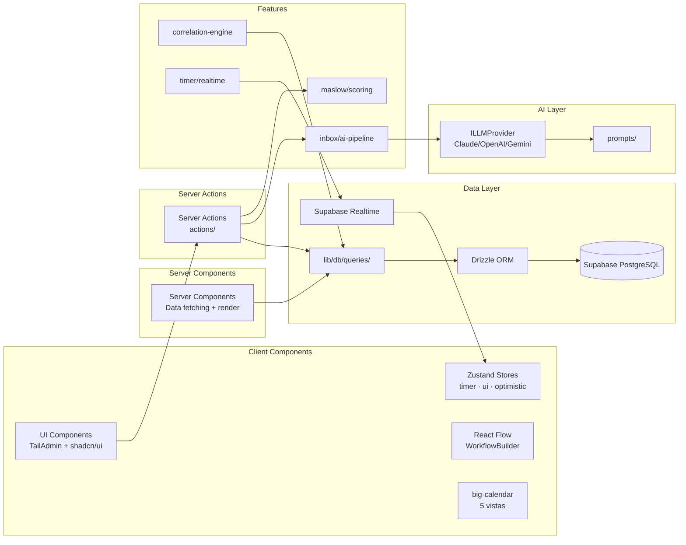

# Architecture — 5. Components

> **Documento:** [Architecture Index](./index.md)
> **Sección:** 5 de 17

---

## 5.1 Feature Components

**`features/maslow/`** — Motor de Scoring Maslow

- **Responsabilidad:** Calcular score por área y Life System Health Score global con multiplicadores ponderados
- **Interfaces:** `calculateAreaScore(responses) → number`, `calculateGlobalScore(areaScores) → number`, `getAlerts(areaScores) → Alert[]`
- **Dependencias:** `lib/db/queries/area-scores.ts`
- **Nota:** Código puro, sin IA. Fórmula: `Score_global = Σ(score_área × multiplicador) / Σ(multiplicadores)` donde Σpesos = 11.4

**`features/calendar/`** — Adaptador big-calendar

- **Responsabilidad:** Adaptar big-calendar a Tailwind CSS 4 (migración v3→v4), integrar rrule para eventos recurrentes, conectar con Supabase Realtime para timer
- **Interfaces:** `<LifeCalendar />` (wrapper), `generateOccurrences(rrule, range) → Event[]`
- **Dependencias:** `big-calendar`, `rrule`, `features/timer/`

**`features/correlation-engine/`** — Motor Estadístico

- **Responsabilidad:** Calcular correlaciones Pearson/Spearman entre métricas. Detectar bucles, leverage points, bottlenecks. Generar insights en lenguaje natural via ILLMProvider.
- **Interfaces:** `runCorrelationAnalysis(userId) → CorrelationResult[]`, `generateInsights(correlations) → string`
- **Dependencias:** `lib/db/queries/correlations.ts`, `lib/ai/providers/`
- **Ejecución:** Solo desde Supabase Edge Function (cron nocturno). No en UI.

**`features/workflow-builder/`** — Visual Workflow Builder

- **Responsabilidad:** Canvas React Flow con nodos Task + Step, coloreado por executor_type
- **Interfaces:** `<WorkflowBuilder workflowId={id} />`, nodos customizados por tipo
- **Dependencias:** `@xyflow/react`
- **Colores:** azul=human, púrpura=ai, degradado=mixed

**`features/inbox/`** — Procesamiento IA de Inbox

- **Responsabilidad:** Pipeline: texto libre → clasificación IA → propuesta slot → confirmación → activity creada
- **Interfaces:** `processInboxItem(text, userId) → InboxSuggestion`, `confirmInboxItem(itemId, slot) → StepActivity`
- **Dependencias:** `lib/ai/providers/`, `lib/db/queries/calendar.ts`
- **Fallback:** Si ILLMProvider falla → modo manual automático (FR22)

**`features/timer/`** — Time Tracking con Realtime

- **Responsabilidad:** Start/stop/pause con Realtime Supabase. Estado en Zustand para UI optimista.
- **Interfaces:** `useTimer(stepActivityId)` → hook con `start()`, `pause(reason)`, `stop()`
- **Dependencias:** Supabase Realtime, Zustand `timerStore`

## 5.2 AI Layer

**`lib/ai/providers/`** — Multi-proveedor IA

```typescript
interface ILLMProvider {
  complete(prompt: string, options?: LLMOptions): Promise<string>
  isAvailable(): Promise<boolean>
}

class ClaudeProvider implements ILLMProvider { ... }
class OpenAIProvider implements ILLMProvider { ... }
class GeminiProvider implements ILLMProvider { ... }

// Factory — lee env vars para seleccionar proveedor
function createLLMProvider(): ILLMProvider
```

**`lib/ai/prompts/`** — Templates de prompts por caso de uso

- `inbox-classification.ts` — Clasificación + área + slot sugerido
- `correlation-insights.ts` — Patrones en lenguaje natural
- `weekly-review.ts` — Síntesis semanal
- `area-diagnosis.ts` — Análisis diagnóstico inicial

## 5.3 Data Layer

**`lib/db/schema/`** — Schema Drizzle ORM (fuente de verdad del schema)

- `areas.ts`, `okrs.ts`, `projects.ts`, `workflows.ts`, `steps-activities.ts`, `habits.ts`, `inbox.ts`, `skills.ts`, `correlations.ts`, `templates.ts`

**`lib/db/queries/`** — Funciones de query reutilizables

- Cada dominio tiene su archivo: `areas.ts`, `calendar.ts`, `correlations.ts`, etc.
- **Regla:** Ningún Server Action accede a `db` directamente — siempre via estas funciones

**`actions/`** — Next.js Server Actions por feature

- `actions/calendar.ts`, `actions/inbox.ts`, `actions/okrs.ts`, etc.
- Usan funciones de `lib/db/queries/` y `lib/ai/providers/`

## 5.4 Diagrama de Componentes


