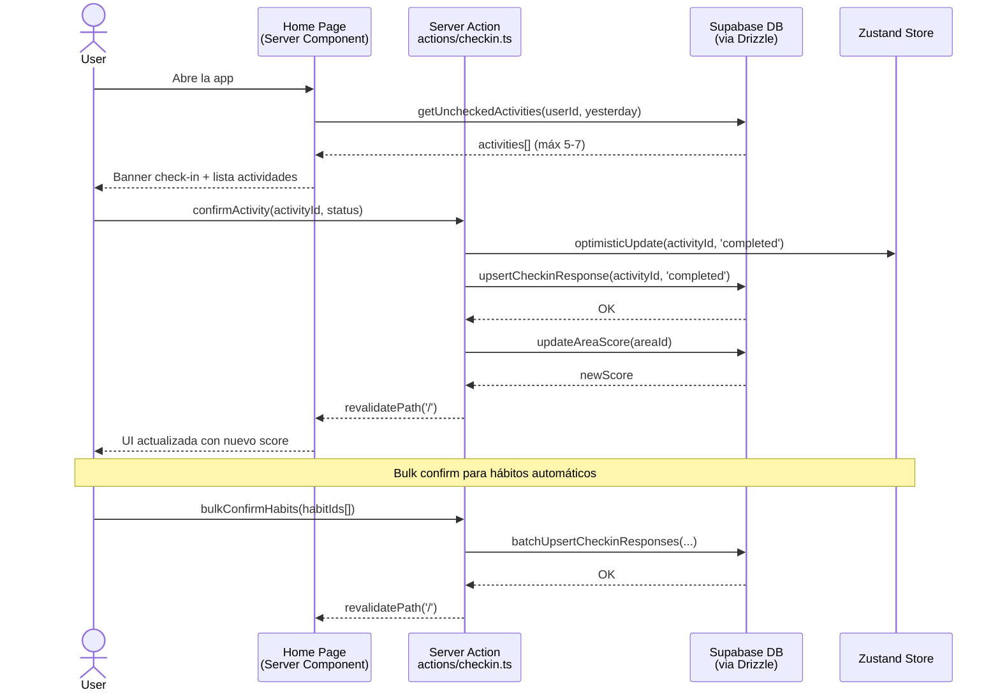
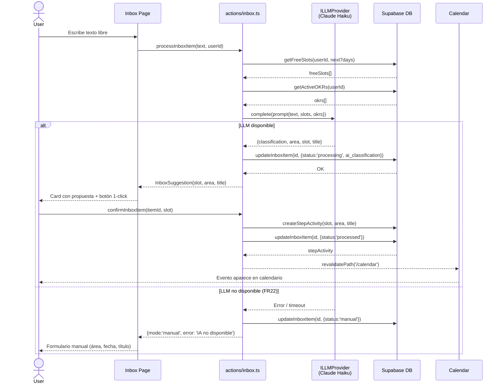
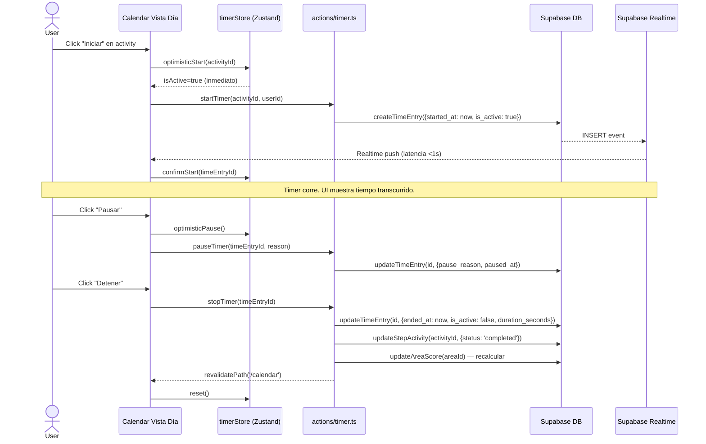
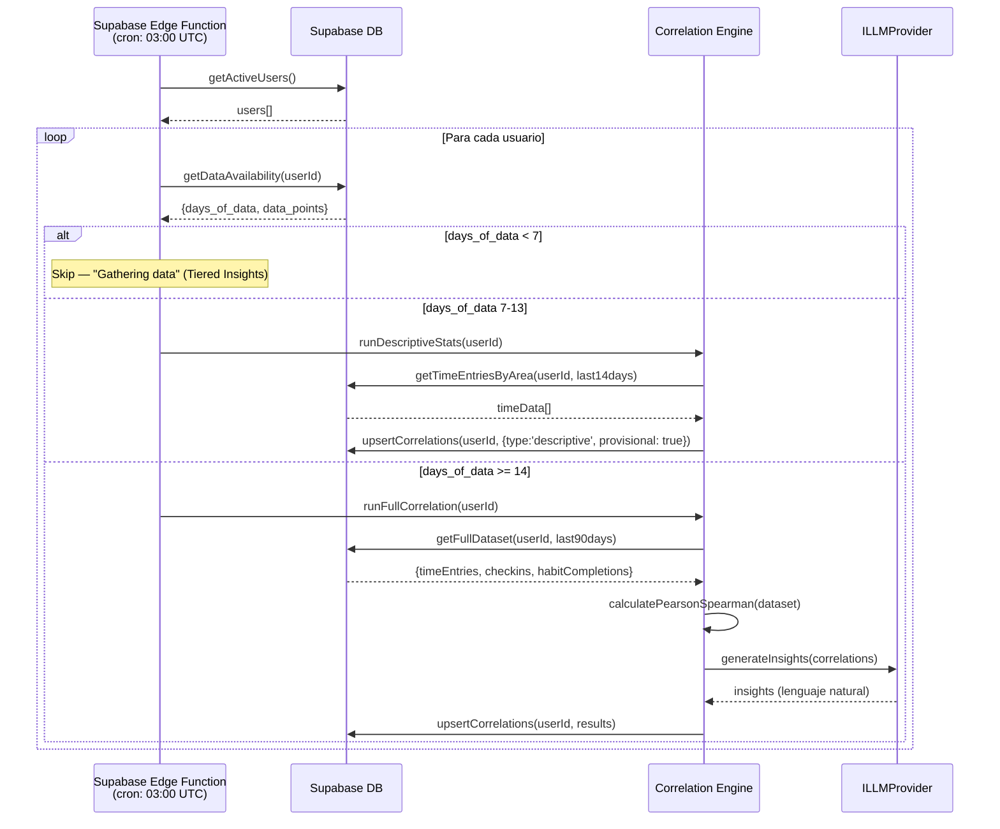

# Architecture — 7. Core Workflows

> **Documento:** [Architecture Index](./index.md)
> **Sección:** 7 de 17

---

## 7.1 Daily Check-in Flow

## 7.2 Inbox → IA → Calendario Flow

## 7.3 Timer Start/Stop con Realtime

## 7.4 Motor de Correlaciones (Cron Nocturno)

