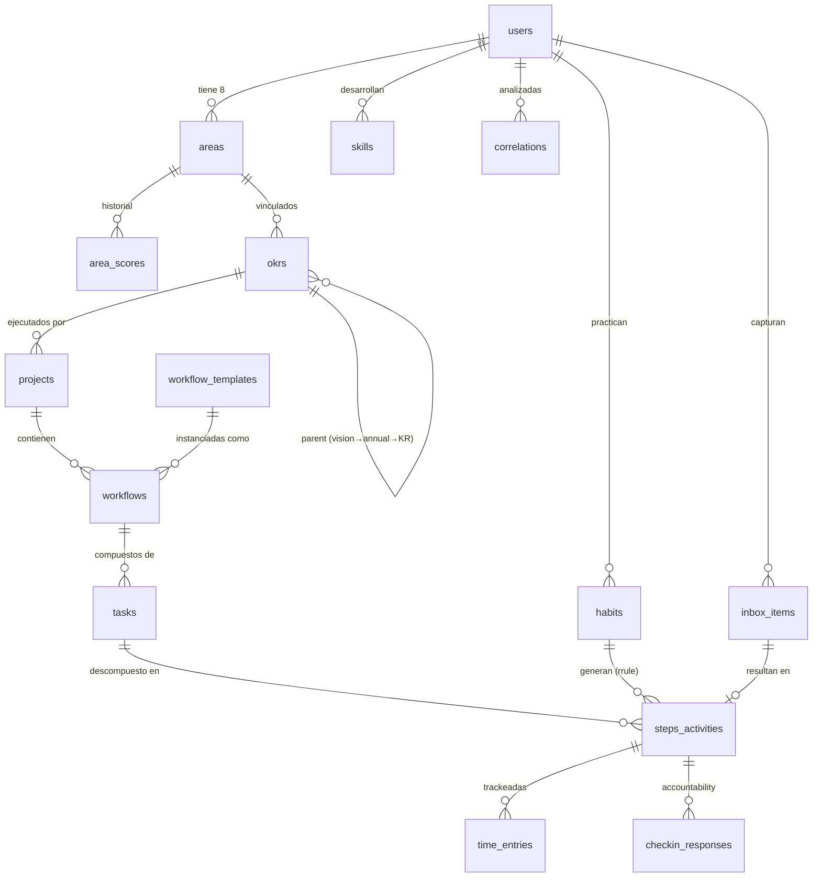

# Architecture — 4. Data Models (Conceptual)

> **Documento:** [Architecture Index](./index.md)
> **Sección:** 4 de 17

> **Nota:** Los modelos conceptuales aquí definen entidades y relaciones. El DDL completo (CREATE TABLE, índices, RLS policies, triggers) es responsabilidad de @data-engineer (Dara). Schema implementado en `lib/db/schema/`.

---

## 4.1 Modelo Central — Jerarquía de Vida

```
User
└── Area (8 fijas — Maslow hierarchy)
    ├── AreaScore (histórico de scores diarios)
    └── OKR (Visión 5Y → Anual → KR trimestral)
        └── Project
            └── Workflow (template-based)
                └── Task (fase)
                    └── Step/Activity (executor_type: human|ai|mixed)
                        └── TimeEntry (start/stop)
```

## 4.2 Entidades Principales

**`areas`** — Las 8 áreas Maslow (datos semi-estáticos por usuario)

- `id`, `user_id`, `maslow_level` (1-8), `name`, `group` (d_needs|b_needs), `weight_multiplier`
- `current_score` (0-100), `last_activity_at`

**`area_scores`** — Histórico de scores (snapshot diario)

- `id`, `area_id`, `user_id`, `score`, `scored_at` (date)

**`okrs`** — OKRs y Visión

- `id`, `user_id`, `type` (vision|annual|key_result), `parent_id`, `title`, `description`
- `quarter` (Q1-Q4), `year`, `area_id`, `progress` (0-100, calculado)
- `status` (active|completed|cancelled)

**`projects`** — Proyectos vinculados a área + KR opcional

- `id`, `user_id`, `area_id`, `okr_id?`, `title`, `description`
- `status` (active|completed|archived), `template_id?`

**`workflows`** — Flujos dentro de proyectos

- `id`, `project_id`, `user_id`, `title`, `template_id?`
- `squad_type` (dev|research|coach|none), `status`

**`tasks`** — Fases de un workflow

- `id`, `workflow_id`, `user_id`, `title`, `order`, `status`

**`steps_activities`** — Entidad unificada (FR5 — Steps = Activities)

- `id`, `task_id?`, `user_id`, `area_id`
- `title`, `description`, `executor_type` (human|ai|mixed)
- `planned` (boolean), `ai_agent?`, `verification_criteria?`
- `status` (pending|in_progress|completed|skipped)
- `scheduled_at?`, `completed_at?`
- `is_habit` (boolean), `habit_id?`

**`time_entries`** — Tracking de tiempo

- `id`, `step_activity_id`, `user_id`
- `started_at`, `ended_at?`, `duration_seconds?`
- `pause_reason?`, `is_active` (boolean)

**`habits`** — Hábitos recurrentes

- `id`, `user_id`, `area_id`, `title`
- `rrule` (string RFC 5545), `duration_minutes`
- `streak_current`, `streak_best`, `last_completed_at`

**`inbox_items`** — Captura de Inbox

- `id`, `user_id`, `raw_text`, `status` (pending|processing|processed|manual)
- `ai_classification?`, `ai_suggested_area_id?`, `ai_suggested_slot?`
- `step_activity_id?` (resultado del procesamiento), `created_at`

**`checkin_responses`** — Daily Check-in

- `id`, `user_id`, `step_activity_id`, `checkin_date`
- `status` (completed|skipped|postponed), `energy_level?` (1-5)
- `notes?`

**`skills`** — Habilidades con nivel

- `id`, `user_id`, `area_id?`, `name`
- `level` (beginner|intermediate|advanced|expert)
- `time_invested_seconds` (calculado desde time_entries), `auto_detected` (boolean)

**`correlations`** — Resultados del motor de correlaciones (caché)

- `id`, `user_id`, `computed_at`
- `type` (positive|negative|neutral), `confidence` (0-1)
- `entity_a_type`, `entity_a_id`, `entity_b_type`, `entity_b_id`
- `correlation_value` (Pearson/Spearman), `description_nl` (lenguaje natural)
- `data_points_count`, `days_of_data`

**`workflow_templates`** — Templates predefinidos (8 MVP)

- `id`, `name`, `category`, `executor_type_default`
- `tasks_config` (JSONB — estructura de tasks/steps)
- `squad_type`, `description`

## 4.3 Diagrama ER Simplificado


