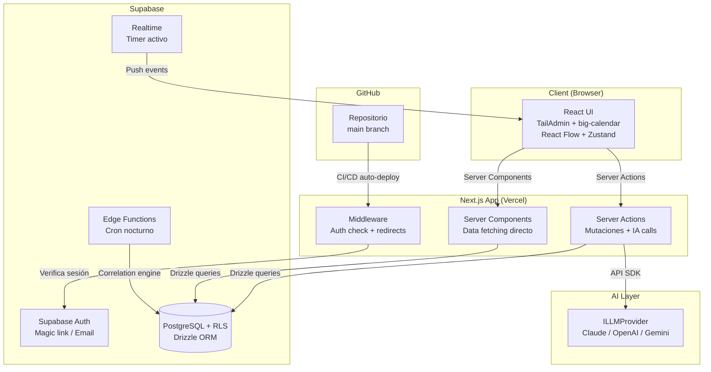

# Architecture — 2. High Level Architecture

> **Documento:** [Architecture Index](./index.md)
> **Sección:** 2 de 17

---

## 2.1 Technical Summary

life-os es una **aplicación monolítica full-stack** construida sobre Next.js 16 con App Router, donde el servidor y el cliente coexisten en un único repositorio y despliegue. La capa de datos es Supabase (PostgreSQL con RLS), accedida vía Drizzle ORM para type-safety y gestión de migraciones. La comunicación cliente-servidor usa **Next.js Server Actions** — sin capa REST separada en MVP. El estado global de UI se gestiona con Zustand; el estado del servidor se deriva de Server Components y refrescado por revalidación post-action. La arquitectura de IA es multi-proveedor via interfaz `ILLMProvider`, invocada desde Server Actions. Supabase Realtime alimenta el único caso de uso que requiere push en tiempo real: el timer activo.

## 2.2 High Level Overview

| Dimensión                | Decisión                                                            | Justificación                                                                |
| ------------------------ | ------------------------------------------------------------------- | ---------------------------------------------------------------------------- |
| **Estilo arquitectural** | Monolito modular (feature-based)                                    | MVP single-user, un desarrollador + AIOS. Sin overhead de microservicios.    |
| **Repository**           | Monorepo (single Next.js app)                                       | Todo en un repositorio: frontend, server actions, DB schema, edge functions. |
| **API layer**            | Next.js Server Actions                                              | Sin REST API separada en MVP. Reduce boilerplate, type-safe end-to-end.      |
| **Renderizado**          | Server Components por defecto + Client Components donde necesario   | Máximo performance, datos frescos sin fetch en cliente.                      |
| **Data fetching**        | Server Components leen directo de DB; mutaciones via Server Actions | Simple, sin capa de API, RLS aplicado en Supabase.                           |
| **Realtime**             | Supabase Realtime solo para timer activo                            | Latencia <1s requerida solo en ese caso de uso (NFR7).                       |
| **Background jobs**      | Supabase Edge Functions (cron nocturno)                             | Motor de correlaciones — no bloquea UI.                                      |

## 2.3 Diagrama de Arquitectura

## 2.4 Patrones Arquitecturales

- **Feature-based Module Pattern:** El código se organiza por feature (calendar, okrs, inbox, etc.), no por tipo de archivo. Cada feature es autónoma con sus server actions, components y types.
- **Server Action Pattern:** Las mutaciones ocurren en Server Actions (funciones `async` marcadas con `'use server'`). El cliente llama acciones, no endpoints HTTP. Type-safety end-to-end sin codegen.
- **Repository Pattern (Drizzle):** Las queries de DB se encapsulan en funciones en `lib/db/queries/`. Ni los Server Actions ni los Server Components acceden a Drizzle directamente — siempre via funciones de query.
- **Provider Pattern (IA):** La interfaz `ILLMProvider` abstrae el proveedor de IA. El Server Action instancia el proveedor activo via factory, sin código condicional en la lógica de negocio.
- **Optimistic UI Pattern:** Para interacciones críticas (timer start/stop, check-in confirm), la UI actualiza Zustand localmente antes de que complete el Server Action, con rollback en caso de error.
